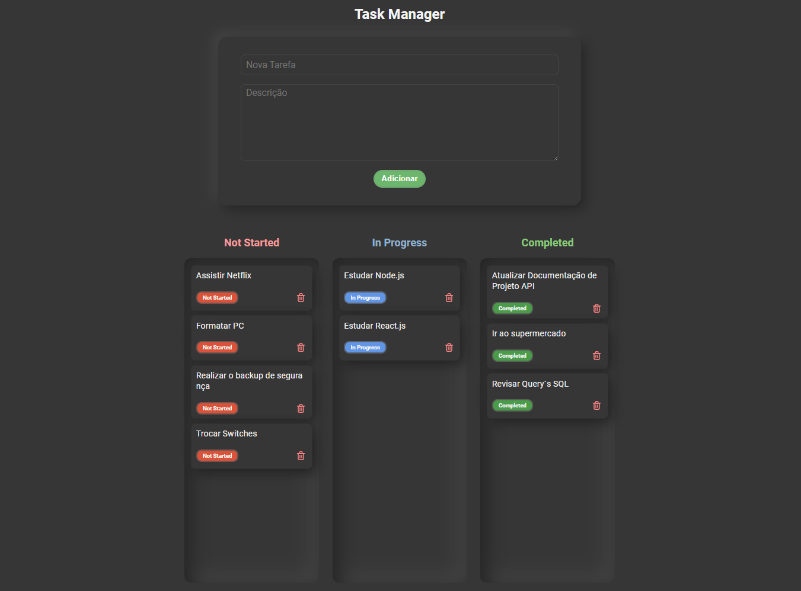
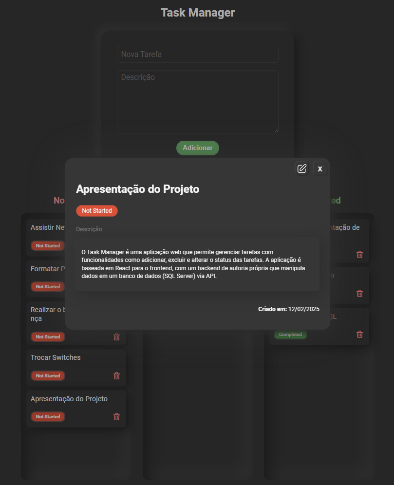

# Task Manager


## Descrição
O Task Manager é uma aplicação web que permite gerenciar tarefas com funcionalidades como adicionar, excluir e alterar o status das tarefas. A aplicação é baseada em React para o frontend, com um backend de autoria própria que manipula dados em um banco de dados (SQL Server) via API.

## Funcionalidades
### Adicionar Tarefa: 
Adicionar tarefas com título e descrição.
### Editar Tarefa:
Visualizar e editar detalhes da tarefa.
### Excluir Tarefa:
Excluir tarefas individualmente.
### Alterar Status:
Alterar o status da tarefa para ***"Not Started"**, **"In Progress"** ou **"Completed"**, arrastando e soltando pelas colunas.

## Tecnologias
- **Frontend**: React, CSS
- **Backend**: Node.js, Express
- **Banco de Dados**: SQL Server
- **Ferramentas Adicionais**: Axios para chamadas HTTP


## Estrutura do Projeto
O frontend é construído com React e segue uma estrutura simples:

### src/components/: 
Componentes React, como TaskBoard, TaskCard, TaskDetailsModal.
### src/App.js: 
Componente principal que gerencia as tarefas e interage com o backend.


O backend é construído com Node.js e Express e está disponível nos meus repositórios públicos: [API Task Tracker](https://github.com/Ale015/javascript_task_tracker)

API: A API fornece endpoints para manipular as tarefas (CRUD).
Banco de Dados: Utiliza SQL Server para armazenar as tarefas.

## Como executar:
1. Clonar o repositório e instalar suas dependências:

```
cd frontend
npm install
``` 

2. Executar o Back=end da maneira que preferir, configurando as variáveis de ambiente e o banco de dados;
2. Executar o frontend

```
npm start
``` 

O aplicativo estará disponível em http://localhost:3000.

---

Este foi um projeto experimental para treinar skills na área de desenvolvimento. Caso queira contribuir ou realizar um fork para melhorar o protótipo sinta-se à vontade.

## Capturas de Tela


